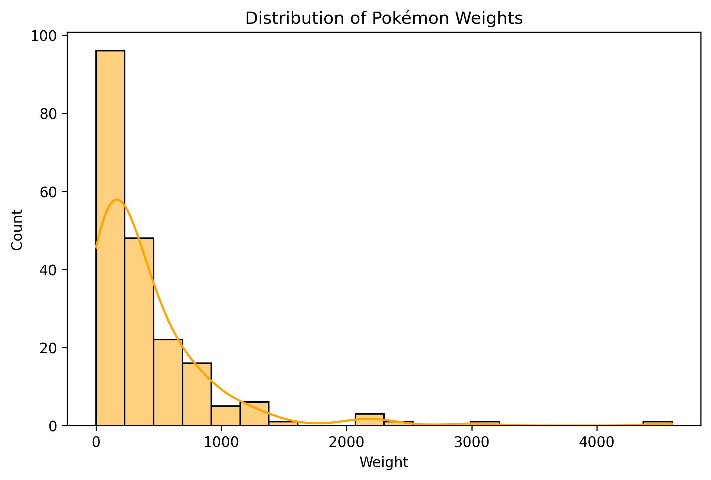
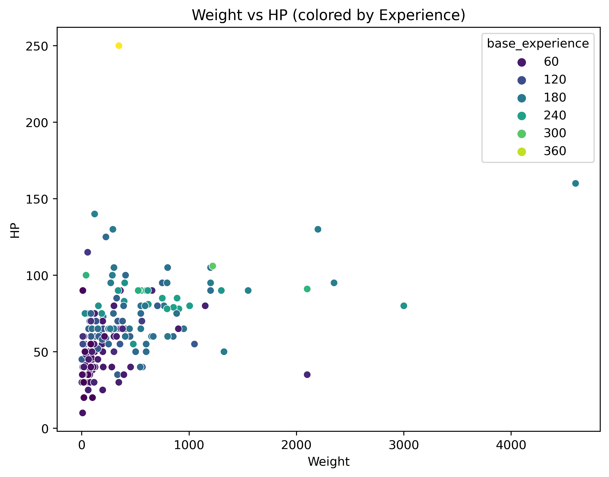

# Exploring Pokémon Stats with the PokeAPI  

Using Python and a public API to collect and analyze Pokémon stats  
*By Nicholas Thomas — Data Curation, Python, API, EDA Project*  

## Introduction

For this project, I explored data from the Pokémon universe using the free [PokeAPI](https://pokeapi.co/). My goal was to see how Pokémon attributes like weight, height, and base experience relate to their battle stats. This small but clean dataset is perfect for demonstrating how APIs can make data collection simple and ethical.

---

## Motivating Question

Do heavier Pokémon tend to have higher HP and attack values?  
This question drove my exploration into how different physical attributes might relate to overall strength.

---

## Getting the Data

I used Python’s `requests` library to fetch data from the PokeAPI for Pokémon 1–200. The API returns structured JSON data, which can easily be turned into a DataFrame with `pandas`.

```python
import requests, pandas as pd

pokemon_data = []
for i in range(1, 152):
    r = requests.get(f"https://pokeapi.co/api/v2/pokemon/{i}").json()
    pokemon_data.append({
        "name": r["name"],
        "base_experience": r["base_experience"],
        "height": r["height"],
        "weight": r["weight"],
        "hp": r["stats"][0]["base_stat"],
        "attack": r["stats"][1]["base_stat"],
        "defense": r["stats"][2]["base_stat"]
    })

df = pd.DataFrame(pokemon_data)
```
## Considerations
The data was obtained from the **[PokeAPI](https://pokeapi.co/)**, which is a free and public RESTful API designed specifically for research, testing, and educational use. Because it’s open and well-documented, there are no ethical issues or scraping restrictions. No authentication or private keys are required, and the data can be accessed safely through simple GET requests. This project followed good API etiquette by making one request per Pokémon in a short loop, avoiding unnecessary server strain.

If someone wanted to build a similar dataset, just reference the code above.

## EDA  

Exploratory Data Analysis revealed several clear patterns and relationships among the Pokémon in the dataset.  
Below are some of the most interesting findings and visual highlights.  

### Summary Statistics  
- The dataset contained **200 Pokémon** and **7 key variables**.  
- The **average attack** value was about 70, and the **average HP** was around 65.  
- **Height** and **weight** were heavily right-skewed — most Pokémon are small, while a few stand out as much larger and heavier.  
- **Base experience** ranged from about 40 to over 600, showing a wide gap between beginner-level and highly experienced Pokémon.  

---

### Weight Distribution  

The first plot shows the distribution of Pokémon weights.  



Most Pokémon cluster on the lighter side, with a long tail representing a few very heavy species.  
This makes sense considering that small creatures like Pikachu and Eevee are far more common than massive ones like Onix or Snorlax.  

---

### Relationship Between Weight and HP  

I also examined how weight relates to HP (health points).  



The upward trend is clear — heavier Pokémon generally have higher HP, meaning they can take more damage in battle.  
While there are a few exceptions, the relationship aligns with intuition: bulkier Pokémon tend to be sturdier and more durable.  

---

Together, these plots show that physical size is a strong indicator of endurance in Pokémon, though not necessarily of attack power.  
In future analysis, it would be interesting to explore how weight and experience combine to influence overall combat effectiveness.

## Resources and Links  

If you’d like to explore this project further or build your own version, the following resources are a good place to start:  

- **PokeAPI Documentation:** [https://pokeapi.co/](https://pokeapi.co/) – Official API reference and endpoints for Pokémon data.  

You can view the full code and dataset for this project here:  
➡️ **GitHub Repository:** [https://github.com/nicholasthomas18/pokemon-api-project](https://github.com/nicholasthomas18/pokemon-api-project)  

